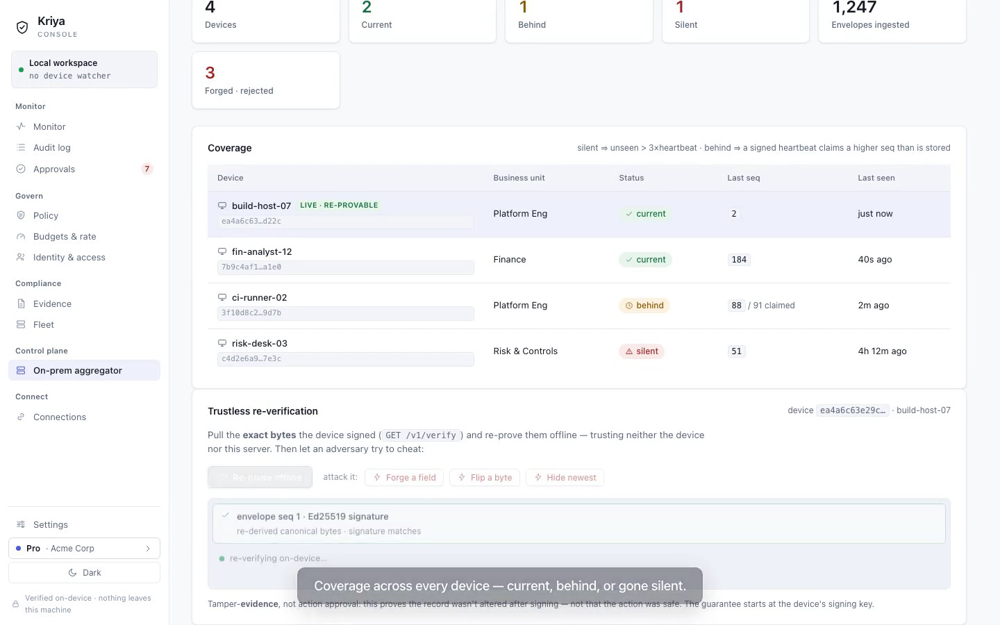

# kriya — demo

Two recordings of the **real product**, for the pitch:

## 1. GUI pitch walkthrough — `kriya-gui-demo.mp4`  ⭐

A ~65-second captioned walkthrough of the actual app (driven by Playwright over the running build):

- **The on-device Console** — Monitor (every agent action a live, re-verified signed receipt), the
  tamper-evident Audit log, human Approvals (RBAC), Policy (deny-by-default), and on-device Compliance
  evidence.
- **The on-prem control plane** — the *On-prem aggregator* dashboard: fleet **coverage** (current /
  behind / silent), and **trustless re-verification** of a device's signed evidence. Then an attacker
  tries to cheat — **forge a field**, **flip a byte**, **hide the newest receipt** — and every attack is
  caught, live, by the real in-browser Ed25519 verifier (the same trust core, parity-tested against
  Rust). Ends on: *signed at the source, re-verified on your box, provably nothing hidden.*

Reproduce: `npm run dev` (port 1420), then `node demo/record-walkthrough.mjs`, then convert
`demo/video/*.webm` → mp4. The Console + Control Plane views render real signed sample data; the
re-proof and the adversarial catches run real cryptography in the browser, not a mock.

## 2. CLI / under-the-hood proof — `kriya-pilot-demo.mp4`

The same trust guarantees shown over the **shipped binaries** (`kriyad` + `kriya-audit`): air-gap
`ingest-file` → serve → `/v1/verify` → offline `kriya-audit --readback` (sig + chain + merkle + tail
anchor). See [`STORY.md`](STORY.md) for the narrative + the honest boundary (tamper-**evidence**, not
action approval), and [`story-demo.sh`](story-demo.sh) / [`kriya-demo.tape`](kriya-demo.tape) to
reproduce.

---

**The honest claim both demos make:** every agent action is device-signed and re-verified offline, so
forged, altered, deleted, or tail-truncated *evidence* is detectable — by an independent auditor,
without trusting the vendor or the network. It proves *evidence integrity*, not that the action itself
was safe; the guarantee starts at the device's signing key.
